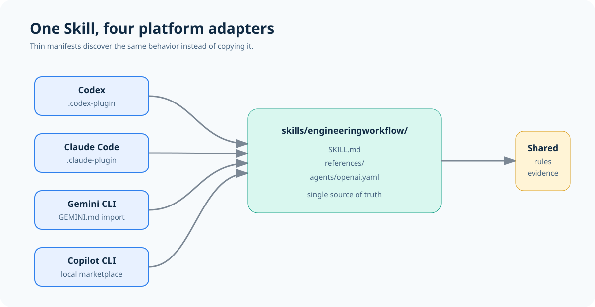
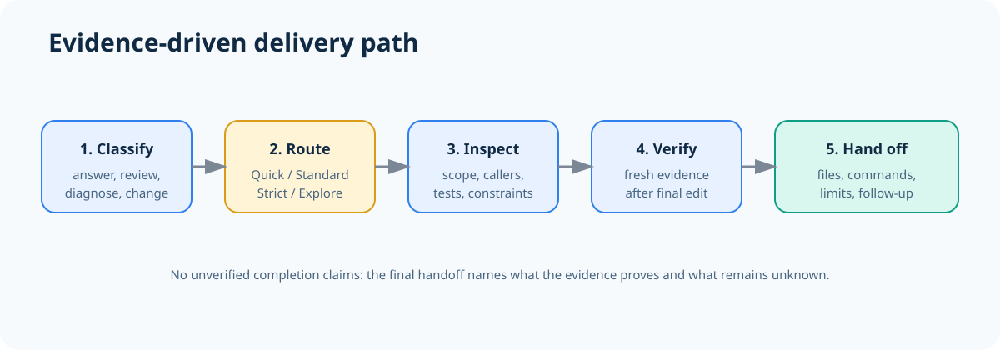
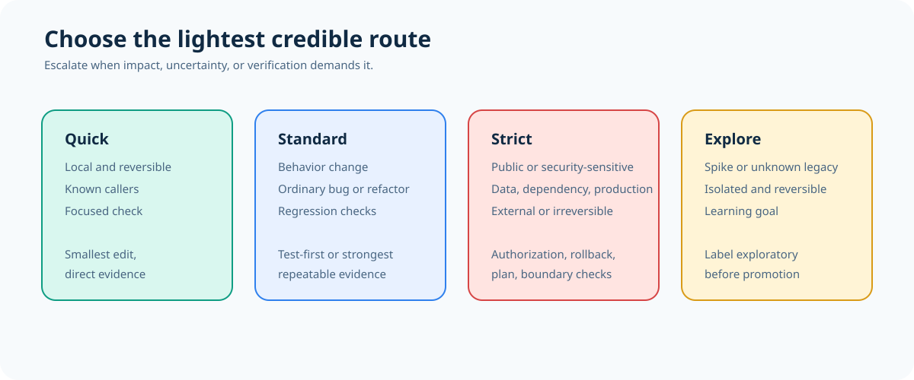
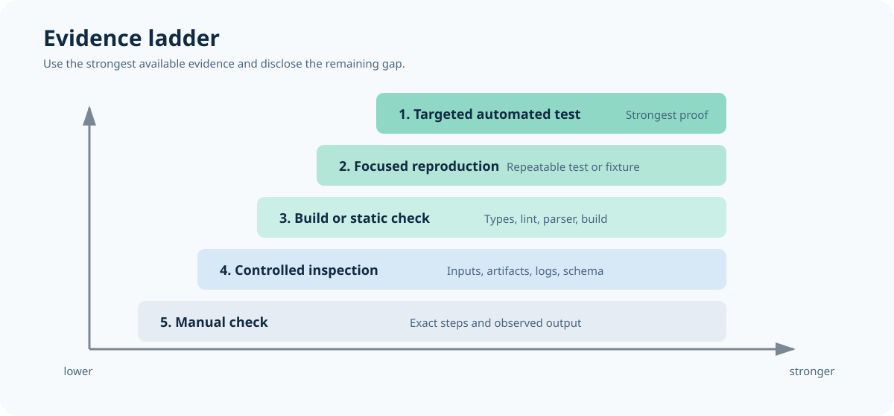
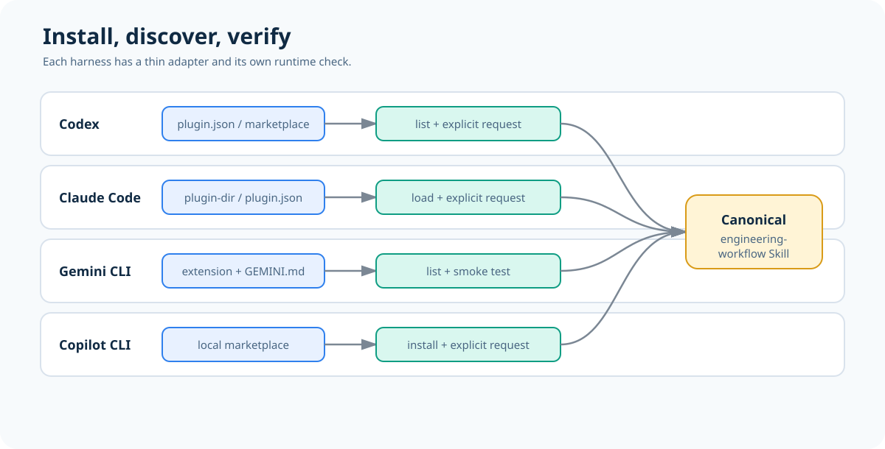

# Engineering Workflow

[Chinese documentation](README_CN.md)

Engineering Workflow is a portable software-engineering Skill for repository work. It routes planning, implementation, debugging, review, validation, and external operations through risk-proportionate evidence and explicit safety boundaries.



## Architecture

`skills/engineeringworkflow/` is the **single source of truth** for behavior. `SKILL.md` contains shared routing rules, while `references/` contains detailed procedures loaded only when relevant. Platform files are thin discovery adapters and never copy the workflow text.



The package supports Codex, Claude Code, Gemini CLI, and GitHub Copilot CLI through these entries:

| Platform | Entry | Loading model |
| --- | --- | --- |
| Codex | `.codex-plugin/plugin.json` | Exposes `./skills/` to Codex. |
| Claude Code | `.claude-plugin/plugin.json` | Exposes `./skills/` to Claude Code. |
| Gemini CLI | `gemini-extension.json`, `GEMINI.md` | Imports the canonical `SKILL.md`. |
| GitHub Copilot CLI | `.agents/plugins/marketplace.json` | Publishes a local marketplace entry. |

## Risk-Proportionate Routing

The Skill chooses the lightest workflow that can credibly protect the outcome. It escalates for shared interfaces, security, data, dependencies, irreversible actions, production changes, and external side effects.



- **Quick**: small, local, reversible edits with known callers.
- **Standard**: ordinary behavior changes, bugs, refactors, or multi-file work.
- **Strict**: public, security-sensitive, data/model, dependency, production, or external work.
- **Explore**: isolated spikes and unknown legacy behavior with an explicit learning goal.

## Evidence Before Claims

Completion claims require fresh evidence after the final edit. When the strongest check is unavailable, the Skill uses the best repeatable alternative and names the remaining uncertainty.



The handoff records changed files, verification commands and outcomes, documentation updates, safety checks, exceptions, known limitations, and required follow-up.

## Install and Use

Use `<REPO_PATH>` below as the absolute path to this checkout. Each harness has its own installation mechanism; installing one platform does not install the Skill into the others.

### Codex

Add the local marketplace or plugin directory using the Codex Plugins UI or `/plugins` command, then install `engineering-workflow`. Verify that **Engineering Workflow** appears in the installed plugin or Skill list. For deterministic routing, invoke `$engineering-workflow` explicitly.

The package manifest is `.codex-plugin/plugin.json`, and it exposes `./skills/`. Local plugin UI and CLI details can vary by Codex version, so follow the commands shown by your installed version.

### Claude Code

Start a local plugin session with:

```bash
claude --plugin-dir <REPO_PATH>
```

Ask Claude Code to use `engineering-workflow` and confirm it reads `skills/engineeringworkflow/SKILL.md`. The `.claude-plugin/plugin.json` manifest exposes the shared `./skills/` directory.

### Gemini CLI

Install the local extension from its parent directory:

```bash
gemini extensions install ./EngineeringWorkflow
```

Use an absolute path if the checkout has another name:

```bash
gemini extensions install <REPO_PATH>
```

`gemini-extension.json` selects `GEMINI.md`, which imports `@./skills/engineeringworkflow/SKILL.md`. Confirm the extension appears in Gemini's extension list, then run a smoke test in a repository.

### GitHub Copilot CLI

Register the repository-local marketplace and install its plugin:

```bash
copilot plugin marketplace add <REPO_PATH>/.agents/plugins
copilot plugin install engineering-workflow@engineering-workflow
```

If your Copilot CLI version uses an interactive plugin manager, add `<REPO_PATH>/.agents/plugins` there instead. Confirm the installed plugin list contains `engineering-workflow`.



## Validate the Package

Run the offline package validator from the repository root:

```bash
python scripts/validate_package.py
```

It checks manifest JSON, canonical Skill paths, Gemini's import, and README/image coverage. It does not start Codex, Claude Code, Gemini CLI, or Copilot CLI, so it cannot prove runtime loading or automatic Skill selection.

For a platform smoke test, install the package, open a repository, and ask:

```text
Use engineering-workflow to classify this repository task, state the proving evidence, and do not edit files.
```

Confirm that the platform reads `skills/engineeringworkflow/SKILL.md` and selects an appropriate route.

## Maintaining the Skill

Change workflow behavior only in `skills/engineeringworkflow/SKILL.md` or its linked `references/` files. After a behavior change:

1. Read the matching scenario in `skills/engineeringworkflow/references/pressure-scenarios.md`.
2. Update the relevant reference when a detailed procedure changes.
3. Run `python scripts/validate_package.py`.
4. Reload affected local plugins and run platform smoke tests that are actually available.

The repository contains local package metadata only. Remote marketplace publication, release signing, version promotion, and license selection require separate owner approval.


