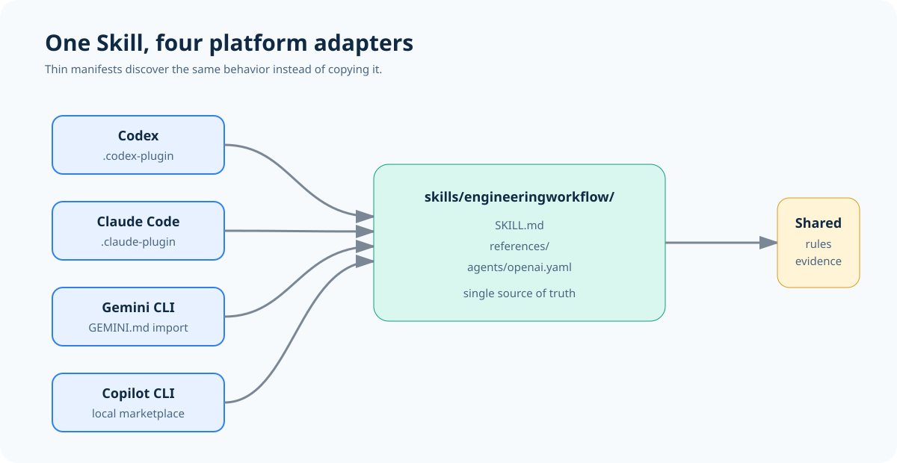
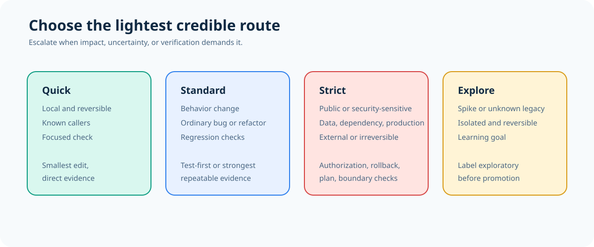
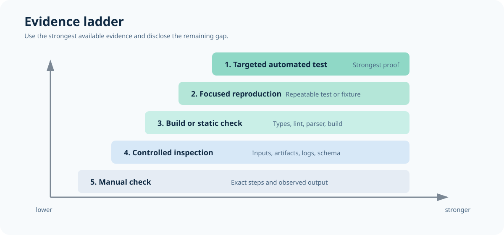
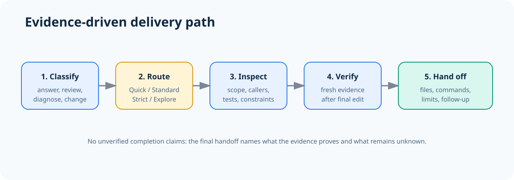
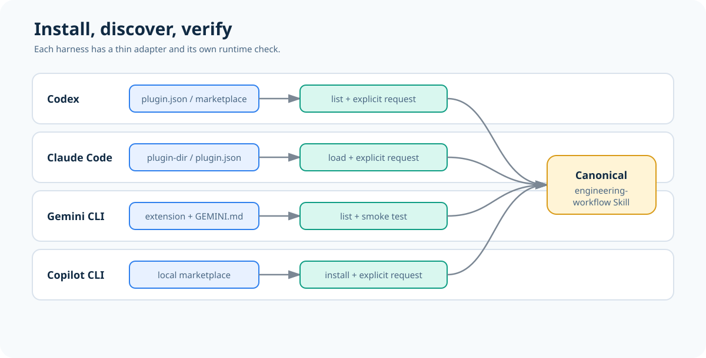

# AI 写得更快之后，谁来保证它真的能交付？

## 一套把“会生成”变成“可上线”的工程化工作流

> 写代码的门槛正在下降，但交付的门槛没有。
>
> 当 AI 能在几分钟内生成一个功能，真正拉开差距的，就不再是“能不能写出来”，而是：你能不能判断风险、留下证据，并把结果稳稳交给下一个人。



最近，越来越多团队把 AI 放进软件研发流程：让它读仓库、拆任务、写代码、修 Bug、补测试，甚至直接参与发布。

速度确实快了。新的问题也随之出现：

- 一个看似简单的改动，是否碰到了公共接口？
- AI 说“已经修好”，凭什么相信？
- 测试没跑通，是环境问题，还是代码真的有问题？
- 同一个仓库交给 Codex、Claude Code、Gemini CLI 或 Copilot CLI，能不能遵守同一套规则？

如果这些问题只能靠经验、记忆和临场判断来回答，AI 带来的速度很容易在评审、返工和事故里被抵消。

Engineering Workflow 想解决的，正是这一层“交付确定性”：它不是另一个代码生成器，而是一套面向软件仓库任务的通用工程 Skill，把计划、实现、调试、评审、验证和外部操作放进同一条可追溯的工作流里。

## 01 先判断风险，再决定要走多长的流程

很多团队的流程只有两种状态：要么什么都不检查，要么所有任务都走一套沉重的审批。前者容易出事故，后者会让小改动寸步难行。

Engineering Workflow 采用四级路由：让流程强度和任务风险匹配。



| 等级 | 适合什么任务 | 需要守住的底线 |
| --- | --- | --- |
| **Quick** | 调用方明确、局部且可逆的小改动 | 读相邻代码，做一次聚焦检查 |
| **Standard** | 普通行为变更、Bug、重构、多文件工作 | 先理解变更路径，再用可重复证据回归 |
| **Strict** | 公共接口、安全、数据/模型、依赖、生产或外部操作 | 明确授权、影响、回滚和验证方式 |
| **Explore** | 隔离的探索、技术试验、未知遗留行为 | 写清学习目标、隔离范围和退出条件 |

这个判断有一个很实用的原则：

> 选择“能够可信保护结果的最轻工作流”。

例如，把一个日期格式的字面量从 `MM-dd-yyyy` 改成 `MM-dd-yy`，调用方已知、影响局部、随时可回退，Quick 就够了。

但如果任务变成“替换生产 checkpoint”“安装新依赖”“修改对外 API”，就不能因为“看起来只改一行”而继续走 Quick。风险来自影响面，不来自 diff 的行数。

## 02 真正重要的不是“完成”，而是“拿什么证明完成”

AI 最容易让人误判的地方，是它经常能给出一个听起来完整的结论：

> “问题已经修复，测试也应该没问题。”

工程交付不能停在“应该”。Engineering Workflow 把证据放在结论前面：最终声明必须由最终编辑之后的新鲜证据支持。



证据强度可以按这个顺序逐步提升：

1. 先复现问题，确认你看到的是同一个失败。
2. 做最小修改，避免把无关变化混进修复。
3. 运行最贴近问题的测试或检查。
4. 条件允许时，再做更完整的回归验证。
5. 如果最强验证暂时不可用，明确写出“验证了什么”和“还不知道什么”。

这套方法并不要求每个仓库都有完美的测试基础设施。没有数据库、没有 GPU、没有完整基线时，仍然可以使用捕获的 CSV、最小复现、静态检查、受控输入输出等可重复证据。

关键是不要把“环境缺失”伪装成“结果已证明”。

## 03 一份规则，适配四个平台

团队真正头疼的，往往不是某一个 AI 工具，而是工具越来越多：有人用 Codex，有人用 Claude Code，有人用 Gemini CLI，还有人用 GitHub Copilot CLI。

Engineering Workflow 把行为定义集中在 `skills/engineeringworkflow/SKILL.md`，它是唯一真源；平台文件只负责发现和加载，不复制工作流正文。



这意味着：

- 规则更新一次，多个平台都能沿用同一份行为定义。
- 平台入口可以各自适配，但不会悄悄分叉出四套流程。
- 评审时可以回到同一个文件，追踪规则从哪里来。

仓库目前提供四种接入方式：

| 平台 | 入口 | 使用方式 |
| --- | --- | --- |
| Codex | `.codex-plugin/plugin.json` | 向 Codex 暴露 `./skills/` |
| Claude Code | `.claude-plugin/plugin.json` | 通过本地插件目录加载 |
| Gemini CLI | `gemini-extension.json`、`GEMINI.md` | 导入规范化的 `SKILL.md` |
| GitHub Copilot CLI | `.agents/plugins/marketplace.json` | 暴露本地 marketplace 条目 |



## 04 从安装到第一次使用，只需要一个清晰的动作

以 Codex 为例，在 Plugins 界面或 `/plugins` 命令中添加本地 marketplace 或插件目录，安装 `engineering-workflow`，确认列表里出现 **Engineering Workflow**。

如果使用 Claude Code，可以从本地插件目录启动：

```bash
claude --plugin-dir <REPO_PATH>
```

Gemini CLI 和 Copilot CLI 也有对应的本地安装入口。需要注意：在一个平台安装，并不会自动让其他平台获得这个 Skill。

安装完成后，可以用下面这句话做平台级冒烟验证：

```text
Use engineering-workflow to classify this repository task, state the proving evidence, and do not edit files.
```

你要观察的不是“它有没有回复”，而是三件事：

- 它是否读取了 `skills/engineeringworkflow/SKILL.md`；
- 它是否选择了与任务风险相称的等级；
- 它是否说清楚了完成任务需要哪些证据。

## 05 先在仓库里试一个小任务

不要一上来就把整个生产流程交给 AI。更好的起点，是挑一个边界明确、可回退、容易验证的仓库任务。

比如：

> “在 `format_date.py` 中，把这一处输出从 `MM-dd-yyyy` 改为 `MM-dd-yy`。先判断应该使用哪一级工作流，说明证明结果的检查方式，不要修改其他文件。”

如果它选择 Quick，并能说明局部调用关系、修改范围和聚焦检查，就说明路由规则已经开始发挥作用。

再逐步尝试 Standard：修复一个有捕获 CSV、但没有可用数据库的遗留导入问题；或者尝试 Explore：隔离比较两种解析方案，但明确不改变生产默认值。

当任务涉及生产、依赖、数据或外部副作用时，再进入 Strict，并要求它先说明授权、影响、回滚和验证。

## 06 工程化不是给 AI 加更多束缚，而是给团队更少猜测

AI 的价值不只在于少写几行代码，更在于把重复的判断过程变得稳定、透明、可复盘：

- 什么任务可以快一点？
- 什么任务必须慢下来？
- 哪些结论是事实，哪些只是暂时未知？
- 交接时，下一位工程师需要看到哪些记录？

当这些问题都有固定答案，团队就不必依赖某个“特别会用 AI 的人”。工具可以替换，平台可以变化，但风险分级、证据优先和诚实交接仍然成立。

## 结语：让 AI 的速度，变成团队的交付能力

下一次让 AI 修改仓库前，先问三句话：

1. 这是什么风险等级？
2. 什么证据能证明它真的完成了？
3. 如果最强验证做不到，剩下的未知是什么？

如果你正在搭建团队的 AI 协作规范，或者希望让 Codex、Claude Code、Gemini CLI、Copilot CLI 遵守同一套工程边界，可以从 Engineering Workflow 开始试用：

**GitHub：** https://github.com/wh1090220084/EngineeringWorkflow

先把它装进一个本地仓库，跑一次离线校验：

```bash
python scripts/validate_package.py
```

它会检查 manifest、规范 Skill 路径、Gemini 导入关系以及 README 和图片覆盖情况。它不会替你启动任何平台，也不会假装证明运行时行为；这正是“证据优先”最朴素的一次实践。

> 好的工程流程，不是让每一步都变慢，而是让真正重要的步骤不再被跳过。

---

### 配图清单

本文配图全部复用仓库 README 中已有素材：

- `docs/images/architecture.svg`
- `docs/images/risk-levels.svg`
- `docs/images/evidence-ladder.svg`
- `docs/images/workflow.svg`
- `docs/images/platform-installation.svg`

发布到公众号时，可将 SVG 导出为 PNG 后上传；正文中的图片说明可作为图片下方的图注使用。
